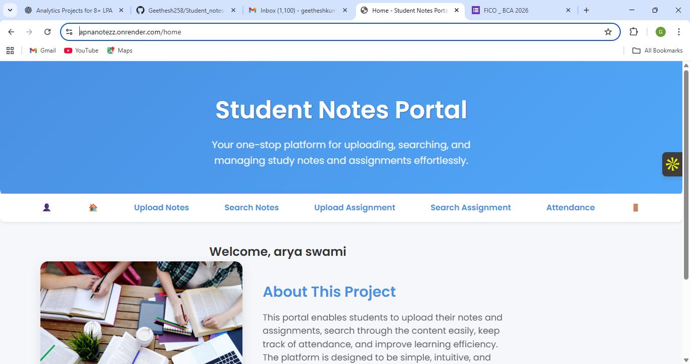
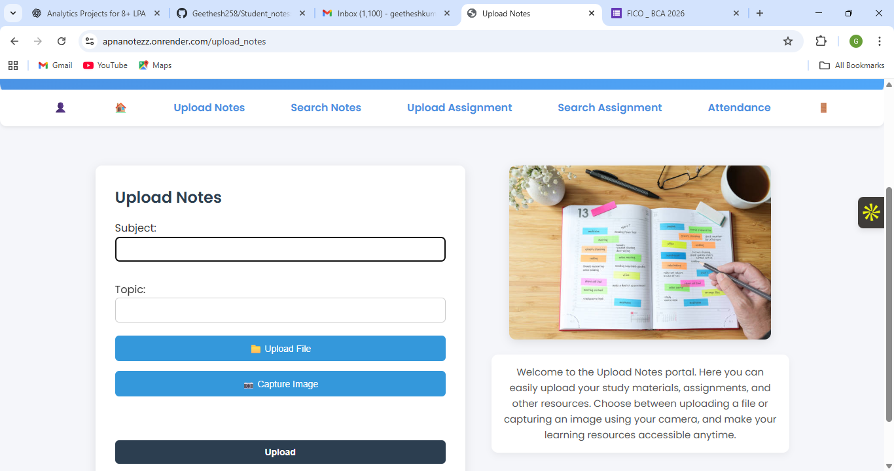
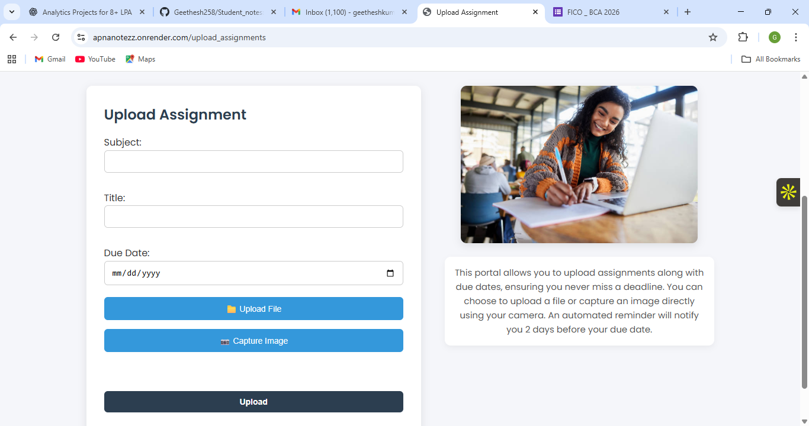
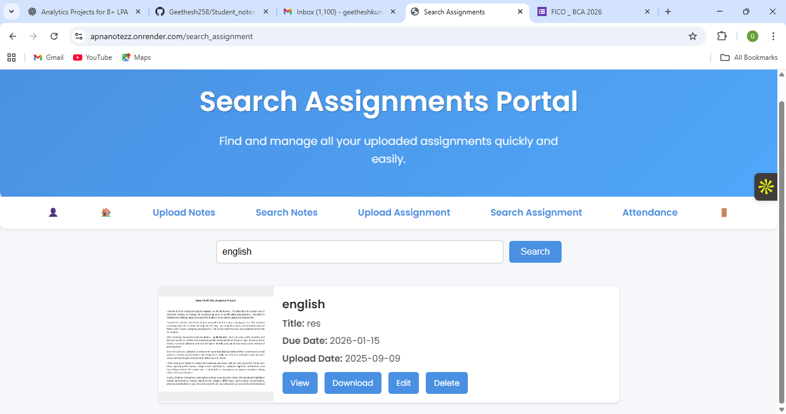
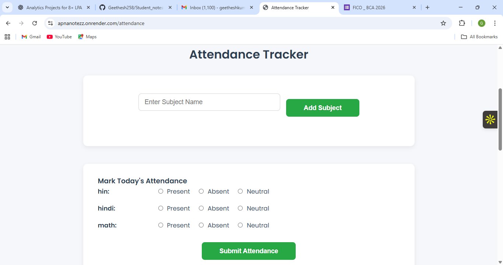
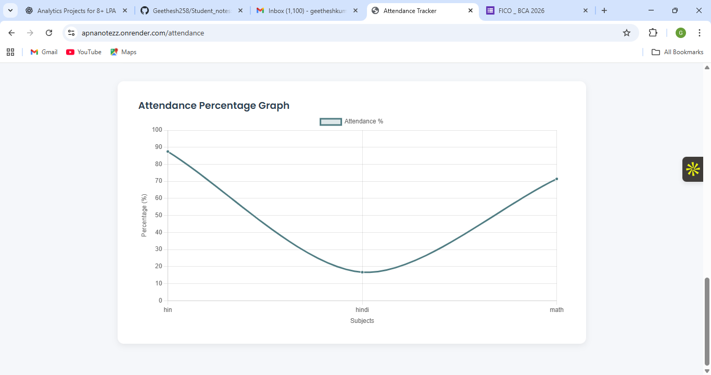

## 📸 Project Screenshots

# 📚 Student Nerves Project

A simple and efficient web application designed for students to **manage notes, assignments, and attendance** in one place.  
Built with **Flask**, **MongoDB**, and modern web technologies, this project helps students stay organized and productive.

---

## 🚀 Features

- ✏️ **Notes Management**  
  - Upload, edit, delete, and share notes  
  - Support for file uploads and camera capture  

- 📖 **Assignments**  
  - Upload and search assignments  
  - Track due dates with color-coded reminders  

- 🎯 **Attendance Tracking**  
  - Mark attendance per subject  
  - Calculate and display percentage automatically  

- 🔐 **User Authentication**  
  - Student registration and login  
  - Secure login with Flask-Login  

- 📊 **Dashboard**  
  - Overview of notes, assignments, and attendance  
  - User-friendly interface for easy navigation  

---

## 🛠️ Tech Stack

- **Frontend:** HTML, CSS, JavaScript  
- **Backend:** Python (Flask)  
- **Database:** MongoDB (via PyMongo)  
- **Authentication:** Flask-Login  
- **Email Features:** Flask-Mail  

